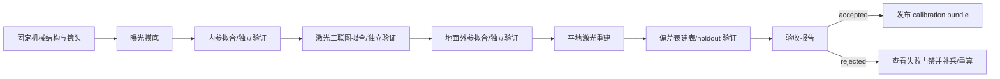
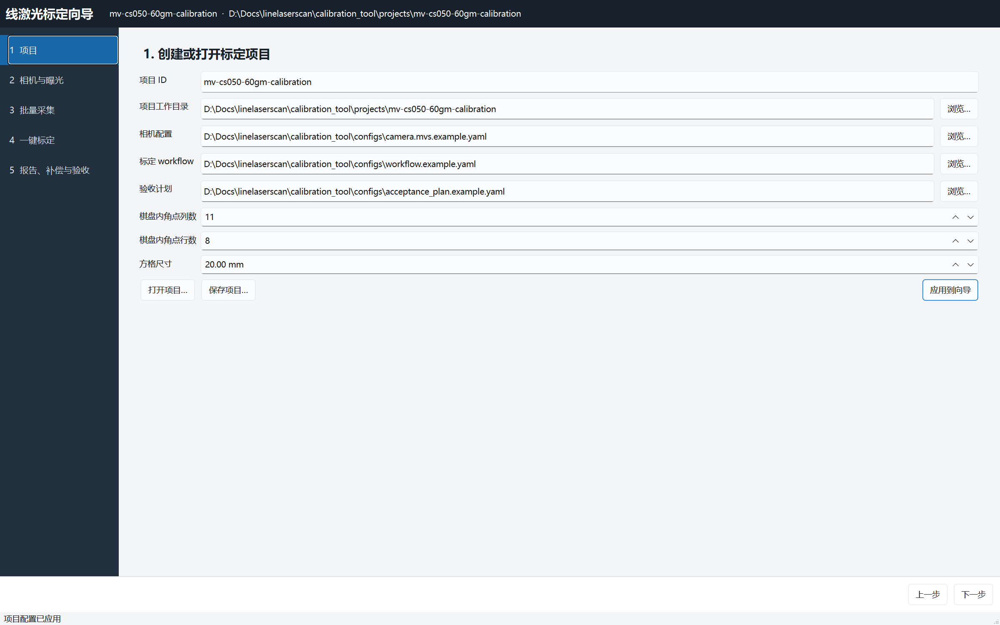
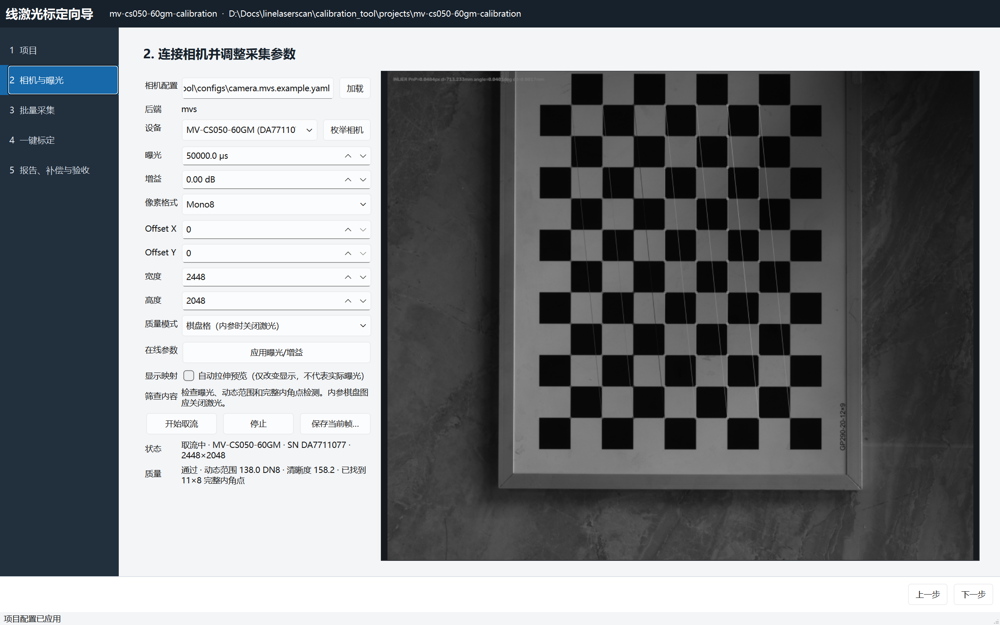
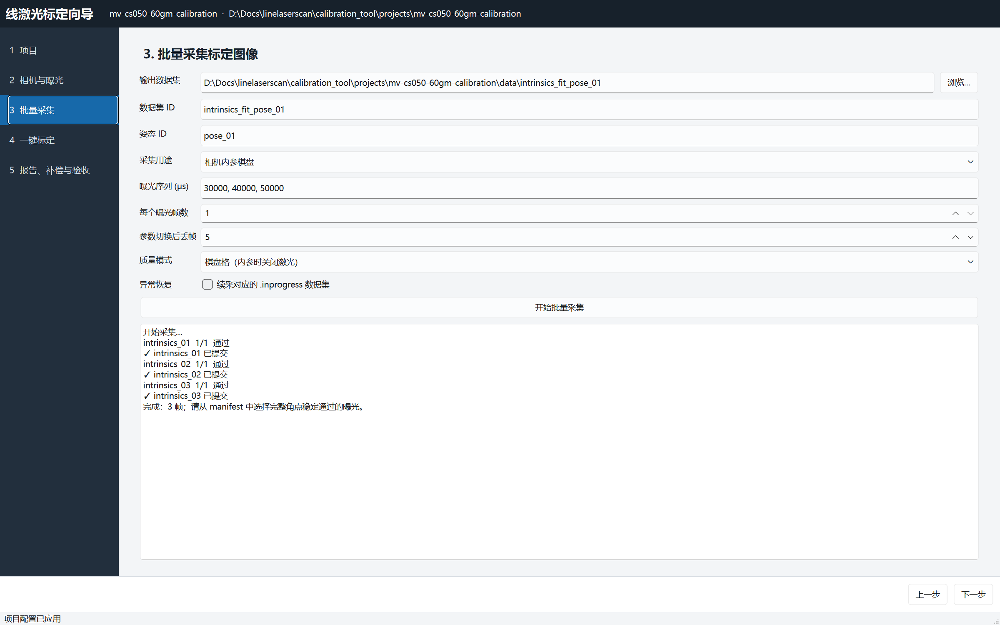
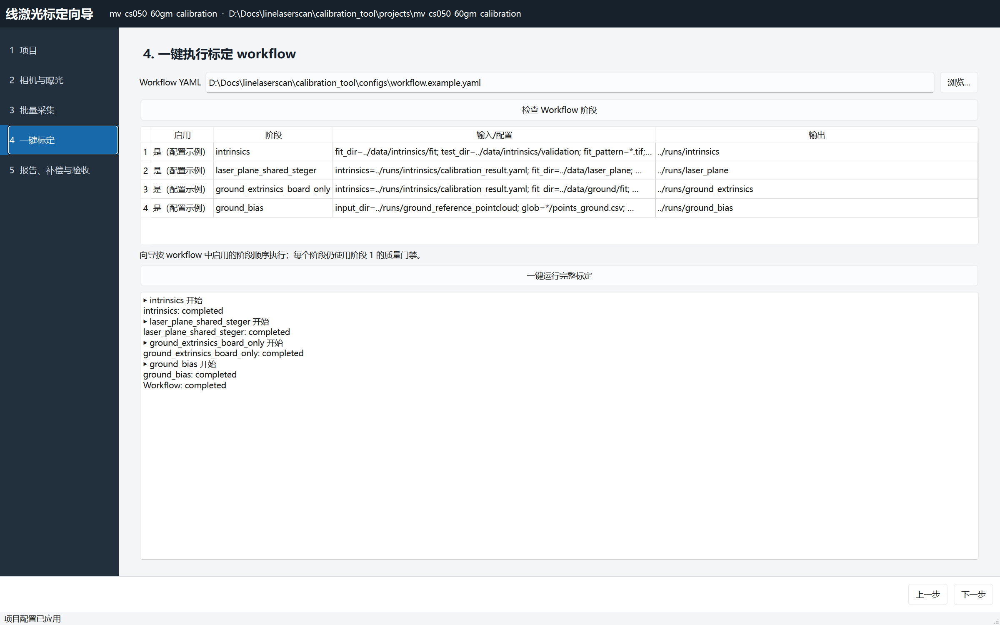
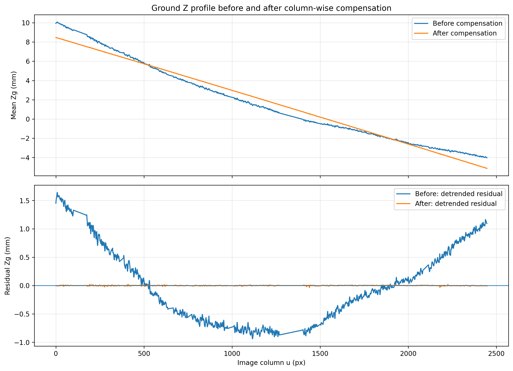
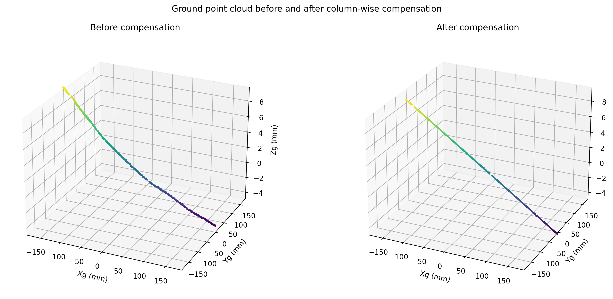
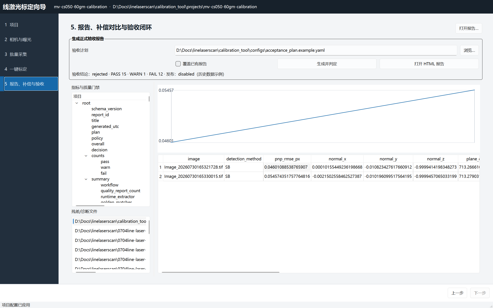

# 线激光统一标定工具用户手册

> 适用版本：阶段 0～4（PySide6 五步向导）  
> 适用相机：当前已验证的海康 `MV-CS050-60GM`，也可用 synthetic 后端演练  
> 正式运行约定：`Mono8`、2448 × 2048、`shared_steger` 提取链  
> 文档中的路径以 `D:\Docs\linelaserscan` 为例

## 1. 现在能否用这个工具完成标定

可以。当前工具能够完成：

1. 创建并保存标定项目；
2. 连接 MVS 相机、实时预览、在线调整曝光与增益；
3. 批量采集内参、激光平面、地面外参和补偿数据，并保存 manifest 与哈希；
4. 一次运行相机内参、激光平面、地面外参、地面点云和补偿 workflow；
5. 查看质量门禁、残差、诊断图和补偿前后结果；
6. 生成 `accepted/rejected` 验收报告；
7. 只有验收通过时才发布不可拆分的 calibration bundle。

需要注意两个使用边界：

- 第 3 页适合曝光摸底或单个姿态采集。正式的多姿态内参数据和激光三联图，推荐使用本手册第 6.7 节的 `capture-plan` YAML，一次定义全部任务后交互采集。
- `configs/workflow.example.yaml` 是结构示例，所有阶段默认 `enabled: false`。必须复制到项目目录、填写实际路径并启用阶段，不能原样点击“一键运行”。

“计算完成”和“正式验收通过”是两个不同结果：

| 结果 | 含义 |
|---|---|
| `Workflow: completed` | 所有已启用标定阶段执行完成，阶段门禁没有失败 |
| `decision: accepted` | workflow、独立验证、补偿、运行配置、golden 和产物全部通过正式验收 |
| `decision: rejected` | 报告已成功生成，但至少有一个质量门禁未关闭，禁止发布 |

当前仓库自带的历史 golden 报告是 `rejected`，这是旧数据存在已知问题，并不表示新项目不能完成标定。

## 2. 完整工作流



一套正式标定至少应包含以下相互独立的数据：

| 数据组 | 推荐数量 | 激光 | 用途 |
|---|---:|---|---|
| 内参拟合集 | 15～25 个不同姿态 | 关闭 | 拟合相机内参与畸变 |
| 内参验证集 | 5 个不同姿态 | 关闭 | 完全独立的重投影验证 |
| 激光平面拟合集 | 12～18 组三联图 | 按帧切换 | 拟合激光平面 |
| 激光平面验证集 | 4～6 组三联图 | 按帧切换 | 独立验证平面误差 |
| 地面外参拟合集 | ≥ 6 张同一基准平面的棋盘图 | 关闭 | 相机坐标系到地面坐标系 |
| 地面外参验证集 | ≥ 2 张 | 关闭 | 独立验证地面外参 |
| 平地补偿数据 | 建表 ≥ 8，建议 20；验证 ≥ 2，建议 5 | 开启 | 生成逐列偏差表并 holdout 验证 |
| 障碍物验收数据 | ≥ 3 张 | 开启 | 端到端三维恢复检查 |

上表“推荐数量”不是简单追求越多越好。重复、模糊或集中在同一位置的图像不能替代姿态多样性。

## 3. 标定前准备

### 3.1 硬件状态

开始采集前逐项确认：

- 相机、镜头、线激光器和支架已经最终固定；
- 镜头焦距、对焦环和光圈已固定，后续不会再旋转；
- 棋盘格平整、无翘曲，方格实际尺寸已用可靠量具确认；
- 棋盘参数填写的是“内角点数量”，不是黑白方格数量；
- 相机网络连接稳定，MVS 客户端和标定工具不会同时占用相机；
- 正式运行若使用 Mono8，则正式标定也统一使用 Mono8；
- ROI、分辨率、PixelFormat 在整套正式数据中保持一致；
- 增益建议保持 `0 dB`，优先通过曝光和现场遮光改善信噪比。

以下变化会使现有标定失效，发生后必须重新标定：

- 相机或激光器位置/角度变化；
- 镜头焦距、对焦或光圈变化；
- 分辨率、ROI、Offset 变化；
- 正式提取器从 `shared_steger` 改为其他算法；
- 相机、镜头或激光器被替换。

### 3.2 软件自检

在 PowerShell 中执行：

```powershell
cd D:\Docs\linelaserscan\calibration_tool

python -m calibration_tool golden-check
python -m calibration_tool camera-list --config configs\camera.mvs.example.yaml
```

期望结果：

- `golden-check` 显示 `matches: true`；
- `camera-list` 能看到 `MV-CS050-60GM` 和正确序列号；
- 若 MVS 客户端正在取流，应先在客户端停止并断开相机，再运行标定向导。

### 3.3 启动向导

真机模式：

```powershell
cd D:\Docs\linelaserscan\calibration_tool
python -m calibration_tool gui --project configs\wizard_project.example.yaml
```

无相机演练模式：

```powershell
python -m calibration_tool gui --simulate
```

## 4. 第 1 步：创建或打开项目



### 4.1 字段说明

| 字段 | 填写方法 |
|---|---|
| 项目 ID | 使用唯一且稳定的名称，例如 `mv-cs050-60gm-20260803` |
| 项目工作目录 | 本次标定的全部数据、运行结果和报告根目录 |
| 相机配置 | 真机使用 `camera.mvs.example.yaml` 的项目副本 |
| 标定 workflow | 第 7 节配置的项目专用 `workflow.yaml` |
| 验收计划 | 第 9 节配置的项目专用 `acceptance_plan.yaml` |
| 棋盘内角点列数/行数 | 当前棋盘为 `11 × 8` 内角点 |
| 方格尺寸 | 当前记录为 `20.00 mm`，应以实测值为准 |

### 4.2 操作步骤

1. 点击“打开项目…”载入已有项目，或直接填写新项目字段。
2. 检查棋盘内角点数和方格尺寸。
3. 点击“保存项目…”，建议保存到项目工作目录下的 `wizard_project.yaml`。
4. 点击“应用到向导”。顶部应显示项目 ID 和工作目录。
5. 点击“下一步”。

建议的项目目录：

```text
projects/<project-id>/
├─ config/
│  ├─ camera.yaml
│  ├─ workflow.yaml
│  ├─ runtime.yaml
│  └─ acceptance_plan.yaml
├─ data/
│  ├─ intrinsics/fit/
│  ├─ intrinsics/validation/
│  ├─ laser_plane/fit/
│  ├─ laser_plane/validation/
│  ├─ ground/fit/
│  ├─ ground/validation/
│  ├─ ground_bias/raw/
│  └─ obstacle_validation/
├─ runs/
├─ reports/
└─ releases/
```

## 5. 第 2 步：连接相机并确定曝光



### 5.1 连接与取流

1. 确认“相机配置”指向项目的 `camera.yaml`，点击“加载”。
2. 点击“枚举相机”，从设备下拉框确认型号和序列号。
3. 正式运行使用 Mono8 时，将“像素格式”设为 `Mono8`。
4. 确认 `Offset X/Y = 0`、宽度 `2448`、高度 `2048`，或填写最终运行时完全一致的 ROI。
5. 选择当前要观察的“质量模式”。
6. 点击“开始取流”。状态应显示实际型号、序列号和分辨率。

### 5.2 在线修改曝光

- 取流期间可以修改“曝光”和“增益”，然后点击“应用曝光/增益”。
- 状态文字出现“相机回读：曝光 …，增益 …”后，才表示参数真正生效。
- 工具会丢弃 2 帧旧参数图像，因此画面不会使用切换前的缓存帧。
- PixelFormat、Offset、宽度和高度会改变数据格式或成像几何，取流期间被禁用。必须先点击“停止”，修改后重新取流。

“自动拉伸预览”只改变屏幕显示，不改变曝光、原始 DN 或保存文件。正式选择曝光时应关闭自动拉伸，并以质量指标和原始图为准。

### 5.3 三种质量模式

| 模式 | 使用场景 | 检查内容 |
|---|---|---|
| 棋盘格 | 内参、棋盘参考帧，激光关闭 | 过曝、欠曝、动态范围、完整内角点检测 |
| 激光线 | 激光帧、平地帧、障碍物帧 | 激光对比度、横向覆盖率、过曝、动态范围 |
| 通用曝光 | 无激光低曝光背景帧 | 过曝、欠曝、动态范围 |

肉眼看到棋盘但显示“未找到完整棋盘”时，按以下顺序检查：

1. 实物是否真的是 `11 × 8` 个内角点；
2. 棋盘最外圈是否完整入镜；
3. 激光是否穿过角点；内参图必须关闭激光；
4. 是否失焦、运动模糊、反光或曝光过暗；
5. 将棋盘移动到画面中央，并减少过大的透视倾斜；
6. 不要用“自动拉伸预览”掩盖原图曝光不足。

### 5.4 曝光摸底

同一姿态依次测试三类曝光，期间不要移动棋盘或相机：

| 图像 | 激光状态 | 可从以下范围开始测试 | 模式 |
|---|---|---:|---|
| 棋盘参考图 | 关闭 | 15000、20000、30000、40000、50000 μs | 棋盘格 |
| 低曝光背景图 | 关闭 | 150、200、300、400、800、1200 μs | 通用曝光 |
| 激光图 | 开启 | 150、200、300、400、800、1200 μs | 激光线 |

曝光范围只是当前现场的起点。最终选择应满足：

- 棋盘完整内角点连续多帧稳定通过；
- 激光中心清晰但不能形成大面积饱和带；
- 激光横向覆盖满足使用区域；
- 增益尽量为 0 dB；
- 同类正式采集使用固定曝光，不在一组拟合数据中混用随意曝光。

## 6. 第 3 步：采集标定数据



### 6.1 页面操作

1. 填写一个尚不存在的“输出数据集”目录。工具拒绝覆盖已完成数据集。
2. 填写唯一“数据集 ID”。
3. 填写姿态 ID，例如 `pose_01`。
4. 选择“采集用途”。内参会自动切换到棋盘格模式；激光平面和地面会切换到激光模式。
5. 曝光摸底时可填写多个曝光值，例如 `30000, 40000, 50000`。
6. 正式单姿态图通常“每个曝光帧数”填 1；重复平地数据可填写多帧。
7. “参数切换后丢帧”建议保持 5。
8. 点击“开始批量采集”，观察每帧质量结果。

每个完成的数据集都包含：

- 原始图像；
- `dataset_manifest.yaml`；
- `frames.csv`；
- 请求参数和相机实际回读参数；
- 设备身份、帧号、时间戳和 SHA-256；
- 每帧曝光、清晰度、棋盘或激光质量结果。

如果采集中断，现场保存在同级的 `.<数据集名>.inprogress`。修复连接后勾选“续采对应的 .inprogress 数据集”，并保持原计划完全不变。

### 6.2 内参数据

1. 关闭激光。
2. 选择棋盘格质量模式和选定的棋盘曝光。
3. 采集 15～25 个拟合姿态，覆盖画面中央、四角和边缘。
4. 同时包含轻微俯仰、偏航、横滚及远近变化，避免所有棋盘都与成像面平行。
5. 再采集至少 5 个完全不同的验证姿态，验证图绝不能复制到拟合集。
6. 所有图必须找到完整内角点；模糊、反光或裁边图应重新采集。

### 6.3 激光平面三联图

每个姿态必须连续采集以下三张图：

```text
chess 001.tif    高曝光、激光关闭，用于棋盘位姿
nolaser 001.tif  低曝光、激光关闭，用作背景
laser 001.tif    相同低曝光、激光开启，用于激光中心
```

最重要的规则是：三张图之间棋盘、相机和支架不能发生任何移动。

推荐操作顺序：

1. 固定第 001 个棋盘姿态并等待支架稳定。
2. 激光关闭，使用棋盘曝光采集 `chess 001.tif`。
3. 不接触棋盘，改为低曝光，采集 `nolaser 001.tif`。
4. 只打开激光，不移动其他部件，采集 `laser 001.tif`。
5. 完成三张后再移动棋盘进入下一个姿态。
6. 拟合集建议 12～18 组；另采 4～6 组独立验证集。

若 `pair_motion_diagnostics.csv` 报告位移超过 1 px 或跟踪无法解析，不要通过放宽门禁继续使用，应删除该组并重新采集。

### 6.4 地面外参数据

本工具推荐使用 `ground_extrinsics_board_only`：

1. 将棋盘刚性放置在最终定义的地面基准平面上。
2. 关闭激光，使用棋盘曝光。
3. 拟合集至少采集 6 张，棋盘在同一物理平面上改变平面内位置和方向。
4. 验证集至少 2 张，不能参与拟合。
5. 不要垫高棋盘或使用明显翘曲的板面；棋盘表面就是该方法定义的 `Z=0` 基准面。

### 6.5 平地补偿与端到端验证数据

1. 移除棋盘和障碍物，保持最终地面基准区域平整。
2. 打开激光，使用最终运行曝光。
3. 建议采集 20～30 帧独立平地图像。
4. workflow 中用 `validation_count` 保留最后 5 帧作为 holdout；这些帧不能参与补偿表建表。
5. 另外放置已知高度或可测量尺寸的障碍物，采集至少 3 张端到端验证图。

正式补偿必须满足：

```text
evaluation_frame_count > 0
build_frame_count + evaluation_frame_count == loaded_frame_count
```

把 `validation_count` 设为 0 会被正式验收拒绝，即使补偿后残差看起来非常小。

### 6.6 第 3 页的单姿态边界

第 3 页每次创建一个完整、不可覆盖的数据集。因此：

- 曝光摸底和单姿态快速采集可直接使用第 3 页；
- 多姿态正式数据若反复使用第 3 页，每个姿态必须使用不同输出目录；
- 激光三联图还需要保证文件命名和目录能被 workflow 的 `chess_pattern/nolaser_pattern/laser_pattern` 匹配；
- 为减少人工整理和重命名，正式采集推荐使用下一节的多任务 YAML。

加载 `capture-plan` 后，第 3 页也支持逐任务引导采集，不需要在第 2 页和第 3 页之间来回切换：

- “预览选中任务”和“下一任务”会应用该 task 的曝光、增益、ROI、像素格式和质量模式，并在第 3 页显示实时画面、棋盘检测提示、激光指标和相机实际回读参数；
- 任务切换后，预览线程先丢弃该 task 的 `settle_frames` 帧；
- 点击“稳定后保存任务帧”时，还会在当前任务参数下再次丢弃 `settle_frames` 帧，再保存下一帧，因此不会把曝光切换过程中的旧帧写入数据集；
- 采集过程中可以直接观察棋盘是否完整入镜、内角点是否检测通过，以及激光覆盖率和饱和告警。`frames > 1` 的 task 需要重复点击保存直到采满。

### 6.7 推荐：使用 capture-plan 一次定义正式采集

下面是一个激光三联图姿态的可运行结构。把它复制为项目专用 YAML，并按同样方式增加 `002、003…`：

```yaml
schema_version: 1
dataset_id: laser_plane_fit
output_dir: ../data/laser_plane/fit
backend: mvs
serial_number: DA7711077

camera:
  exposure_us: 300
  gain_db: 0
  pixel_format: Mono8
  offset_x: 0
  offset_y: 0
  width: 2448
  height: 2048
  timeout_ms: 2000

quality:
  max_saturation_fraction: 0.05
  max_dark_fraction: 0.95
  min_dynamic_range_u8: 20
  min_laser_coverage: 0.30
  require_chessboard_detection: true

board:
  pattern_cols: 11
  pattern_rows: 8

tasks:
  - task_id: chess_001
    pose_id: "001"
    role: chess
    instruction: 固定姿态 001，关闭激光，确认棋盘不再移动。
    frames: 1
    settle_frames: 5
    image_format: tif
    quality_mode: chessboard
    filename_template: "chess {pose_id}{suffix}"
    camera:
      exposure_us: 50000

  - task_id: nolaser_001
    pose_id: "001"
    role: nolaser
    instruction: 保持姿态 001 不动，激光仍关闭，切换低曝光。
    frames: 1
    settle_frames: 5
    image_format: tif
    quality_mode: generic
    filename_template: "nolaser {pose_id}{suffix}"
    camera:
      exposure_us: 300

  - task_id: laser_001
    pose_id: "001"
    role: laser
    instruction: 保持姿态 001 不动，只打开激光。
    frames: 1
    settle_frames: 5
    image_format: tif
    quality_mode: laser
    filename_template: "laser {pose_id}{suffix}"
    camera:
      exposure_us: 300
```

执行：

```powershell
cd D:\Docs\linelaserscan\calibration_tool
python -m calibration_tool capture-plan <项目中的采集计划.yaml> --interactive --preview-window
```

`--preview-window` 会在每个 task 开始前打开实时 OpenCV 窗口，叠加当前曝光、增益、质量告警和棋盘角点检测结果。确认姿态和画面后在窗口中按 Enter/Space 开始正式采集；按 Esc/Q 取消当前采集。未指定该选项时，`--interactive` 保持原来的终端 Enter 确认模式。

## 7. 第 4 步：配置并一键执行标定



截图中的“是（配置示例）”用于说明配置完成后的界面；仓库原始 `workflow.example.yaml` 实际默认全部禁用。

### 7.1 项目专用 workflow

以下是推荐的完整顺序。将路径改成项目实际目录；所有相对路径均以 `workflow.yaml` 所在目录为基准。

```yaml
schema_version: 1
calibration_src: D:/Docs/linelaserscan/calibration/src
continue_on_error: false
report: ../runs/workflow_run.yaml

stages:
  - name: intrinsics
    enabled: true
    options:
      fit_dir: ../data/intrinsics/fit
      test_dir: ../data/intrinsics/validation
      output: ../runs/intrinsics
      fit_pattern: "*.tif"
      test_pattern: "*.tif"
      pattern_cols: 11
      pattern_rows: 8
      square_size_mm: 20

  - name: laser_plane_shared_steger
    enabled: true
    options:
      intrinsics: ../runs/intrinsics/calibration_result.yaml
      fit_dir: ../data/laser_plane/fit
      test_dir: ../data/laser_plane/validation
      chess_pattern: "chess {id:03d}.tif"
      nolaser_pattern: "nolaser {id:03d}.tif"
      laser_pattern: "laser {id:03d}.tif"
      pattern_cols: 11
      pattern_rows: 8
      square_size_mm: 20
      config: D:/Docs/linelaserscan/calibration/config/laser_plane_core_config.yaml
      output_dir: ../runs/laser_plane

  - name: ground_extrinsics_board_only
    enabled: true
    options:
      intrinsics: ../runs/intrinsics/calibration_result.yaml
      fit_dir: ../data/ground/fit
      validation_dir: ../data/ground/validation
      fit_glob: "*.tif"
      validation_glob: "*.tif"
      pattern_cols: 11
      pattern_rows: 8
      square_size_mm: 20
      min_fit_images: 6
      output_dir: ../runs/ground_extrinsics

  - name: reconstruct_shared_steger
    enabled: true
    options:
      input_dir: ../data/ground_bias/raw
      intrinsics: ../runs/intrinsics/calibration_result.yaml
      laser_plane: ../runs/laser_plane/laser_plane.yaml
      extrinsics: ../runs/ground_extrinsics/camera_ground_extrinsics.yaml
      output_dir: ../runs/ground_reference_pointcloud

  - name: ground_bias
    enabled: true
    options:
      input_dir: ../runs/ground_reference_pointcloud
      glob: "*/points_ground.csv"
      output_dir: ../runs/ground_bias
      validation_count: 5
      trend: linear
      aggregate: median
      column_bin_width: 1
      min_samples_per_column: 5

  - name: reconstruct_shared_steger
    enabled: true
    options:
      input_dir: ../data/obstacle_validation
      intrinsics: ../runs/intrinsics/calibration_result.yaml
      laser_plane: ../runs/laser_plane/laser_plane.yaml
      extrinsics: ../runs/ground_extrinsics/camera_ground_extrinsics.yaml
      ground_bias_table: ../runs/ground_bias/ground_bias_table.npy
      output_dir: ../runs/obstacle_validation
```

如果使用第 3 页采集的 Mono8 PNG，把相应 `*.tif` 和三联图 pattern 改成 `*.png`。不要仅修改文件扩展名；图像内容和 manifest 必须保持原始记录。

### 7.2 运行前检查

1. 第 1 页重新选择项目专用 workflow，点击“应用到向导”。
2. 进入第 4 页，点击“检查 Workflow 阶段”。
3. 确认所有需要的阶段显示“是”，输入和输出路径正确。
4. 确认每个输出目录尚不存在或为空。标定算法默认拒绝覆盖旧结果。
5. 点击“一键运行完整标定”。
6. 不要关闭窗口或移动/删除输入数据。

### 7.3 质量门禁

| 阶段 | 必须满足的默认门禁 |
|---|---|
| 内参 | 拟合 RMSE ≤ 0.30 px；独立测试图 ≥ 1；测试 RMSE ≤ 0.50 px |
| 激光平面 | 独立验证 RMSE ≤ 0.25 mm；P95 ≤ 0.50 mm；三联图无未排除运动 |
| 棋盘地面外参 | 独立验证 RMSE ≤ 0.20 mm |
| 混合地面外参（若使用） | `ground_z_std_passed = true` |
| 地面补偿 | 至少 1 帧完全独立的 holdout 验证 |

任一门禁失败时，workflow 会停止并保留已生成的诊断文件。应根据失败项补采或修正配置，不应直接使用 `allow_quality_failure` 绕过正式标定。

## 8. 检查标定产物

workflow 完成后，至少应存在：

```text
runs/
├─ workflow_run.yaml
├─ intrinsics/
│  ├─ calibration_result.yaml
│  ├─ calibration_report.html
│  └─ stage_run.yaml
├─ laser_plane/
│  ├─ laser_plane.yaml
│  ├─ pair_motion_diagnostics.csv
│  └─ stage_run.yaml
├─ ground_extrinsics/
│  ├─ camera_ground_extrinsics.yaml
│  └─ stage_run.yaml
├─ ground_reference_pointcloud/
├─ ground_bias/
│  ├─ ground_bias_table.npy
│  ├─ ground_bias_table.csv
│  ├─ compensation_metrics.json
│  ├─ z_profile_before_after.png
│  └─ pointcloud_before_after.png
└─ obstacle_validation/
```

补偿前后剖面示例：



补偿前后点云示例：



不要只看“补偿后很平”。还要确认 `compensation_metrics.json` 中建表帧和验证帧相互独立。

## 9. 第 5 步：生成验收报告



### 9.1 创建运行配置

在项目 `config/runtime.yaml` 中声明本次标定的不可拆分文件和提取器：

```yaml
schema_version: 1
calibration:
  intrinsics: ../runs/intrinsics/calibration_result.yaml
  laser_plane: ../runs/laser_plane/laser_plane.yaml
  extrinsics: ../runs/ground_extrinsics/camera_ground_extrinsics.yaml
  ground_u_compensation: ../runs/ground_bias/ground_bias_table.npy

extraction:
  method: shared_steger
  shared_steger:
    sigma_px: 1.2
    max_offset_px: 0.75
    min_normal_y: 0.5
    min_response_ratio: 0.0005
```

运行配置中的相机几何和提取器必须与标定时一致。不要把 `centroid`、旧 `steger` 和 `shared_steger` 的产物混成一套。

### 9.2 创建验收计划

把以下内容保存为项目 `config/acceptance_plan.yaml`：

```yaml
schema_version: 1
report_id: mv-cs050-60gm-new-calibration
title: MV-CS050-60GM 正式标定验收报告
output_dir: ../reports/acceptance
policy: D:/Docs/linelaserscan/calibration_tool/configs/acceptance_policy.yaml

inputs:
  workflow_report: ../runs/workflow_run.yaml
  # 新版 workflow report 已包含 overall/counts/gates，可直接兼作质量报告。
  quality_reports:
    - ../runs/workflow_run.yaml
  runtime_config: runtime.yaml
  expected_extractor: shared_steger
  golden_baseline: D:/Docs/linelaserscan/calibration_tool/golden/baseline.yaml
  compensation_metrics: ../runs/ground_bias/compensation_metrics.json
  artifacts:
    - ../runs/ground_bias/ground_bias_table.csv
    - ../runs/ground_bias/z_profile_before_after.png
    - ../runs/ground_bias/pointcloud_before_after.png

release:
  enabled: false
  package_id: mv-cs050-60gm-accepted-v1
  runtime_config: runtime.yaml
  output_dir: ../releases/mv-cs050-60gm-accepted-v1
```

### 9.3 生成和判读报告

1. 第 1 页将“验收计划”设为项目专用 `acceptance_plan.yaml`，点击“应用到向导”。
2. 进入第 5 页。
3. 第一次生成时不勾选“覆盖已有报告”。确需重算同一报告时再勾选。
4. 点击“生成并判定”。
5. 查看 `PASS/WARN/FAIL` 和发布状态。
6. 点击“打开 HTML 报告”，逐项检查失败门禁和补偿前后图。
7. 点击左侧残差/诊断 CSV，可在右侧查看表格和数值曲线。

正式补偿默认验收阈值：

| 指标 | 要求 |
|---|---:|
| 补偿后平均剖面 P–V | ≤ 0.25 mm |
| 补偿后平均剖面 RMS | ≤ 0.05 mm |
| P–V 降幅 | ≥ 80% |
| RMS 降幅 | ≥ 80% |
| 重复性 sigma 中位数 | ≤ 0.02 mm |

报告文件位于验收计划的 `output_dir`：

- `acceptance_report.yaml`：机器可读的完整结论；
- `acceptance_report.html`：自包含交付报告；
- `acceptance_metrics.csv`：全部门禁明细。

## 10. 发布标定包

第一次验收保持 `release.enabled: false`。确认报告为 `accepted` 后：

1. 关闭报告查看器；
2. 将验收计划中的 `release.enabled` 改为 `true`；
3. 使用新的、尚不存在的 `package_id` 和空输出目录；
4. 重新生成验收报告；
5. 工具再次检查 runtime profile、提取器、标定文件和报告；
6. 只有仍为 `accepted` 时才生成发布目录。

发布目录至少包含：

```text
releases/<package-id>/
├─ calibration_bundle.yaml
├─ calibration_result.yaml
├─ laser_plane.yaml
├─ camera_ground_extrinsics.yaml
├─ ground_bias_table.npy
├─ acceptance_report.yaml
└─ acceptance_report.html
```

本阶段只生成独立发布包，不会自动覆盖离线工具或在线工具正在使用的标定文件。

## 11. 应用到 0704 在线测量工具

0704 在线工程路径：

```text
D:\Docs\linelaserscan\0704line-laser-3d-scanner\laser_measurement_tool
```

### 11.1 先确认包格式

验收发布出来的标定包就是第 10 节中的 release 目录。需要注意两点：

1. 发布包中的文件名来自 `config/runtime.yaml` 里 `calibration` 段实际指向的源文件名。因此，如果内参源文件是 `calibration_result.yaml`，包里就是 `calibration_result.yaml`；如果源文件已整理成 `camera_intrinsics.yaml`，包里就是 `camera_intrinsics.yaml`。
2. 发布包的总清单是 `calibration_bundle.yaml`。0704 在线工具生产入口读取的是 `manifest.yaml`，字段结构不同，所以不能只把 `calibration_bundle.yaml` 改名成 `manifest.yaml`。需要按 11.3 节生成 0704 runtime manifest。

也就是说，你贴出的结构是当前推荐的验收发布结构之一：

```text
releases/<package-id>/
├─ calibration_bundle.yaml
├─ calibration_result.yaml
├─ laser_plane.yaml
├─ camera_ground_extrinsics.yaml
├─ ground_bias_table.npy
├─ acceptance_report.yaml
└─ acceptance_report.html
```

但应用到 0704 在线工具时，还需要形成它运行时使用的这一组：

```text
laser_measurement_tool/configs/calibration/
├─ manifest.yaml
├─ calibration_result.yaml
├─ laser_plane.yaml
├─ camera_ground_extrinsics.yaml
└─ ground_bias_table.npy
```

`ground_bias_table.npy` 可以直接被 0704 加载；如果你同时发布了 `ground_bias_table.csv`，也可以改用 CSV，并在 manifest 和 `measure_tool.yaml` 中保持同一个文件名。

### 11.2 备份 0704 当前标定

替换前先备份当前运行包，避免覆盖后无法回退：

```powershell
cd D:\Docs\linelaserscan\0704line-laser-3d-scanner\laser_measurement_tool

$stamp = Get-Date -Format yyyyMMdd_HHmmss
Copy-Item configs\calibration configs\calibration_backup_$stamp -Recurse
Copy-Item configs\measure_tool.yaml configs\measure_tool_backup_$stamp.yaml
```

### 11.3 复制新标定文件并生成 manifest

假设新发布包为：

```text
D:\Docs\linelaserscan\calibration_tool\projects\<project-id>\releases\<package-id>
```

把发布包里的运行必需文件复制到 0704 的 `configs/calibration/`：

```powershell
$release = "D:\Docs\linelaserscan\calibration_tool\projects\<project-id>\releases\<package-id>"
$target = "D:\Docs\linelaserscan\0704line-laser-3d-scanner\laser_measurement_tool\configs\calibration"

Copy-Item "$release\calibration_result.yaml" "$target\calibration_result.yaml" -Force
Copy-Item "$release\laser_plane.yaml" "$target\laser_plane.yaml" -Force
Copy-Item "$release\camera_ground_extrinsics.yaml" "$target\camera_ground_extrinsics.yaml" -Force
Copy-Item "$release\ground_bias_table.npy" "$target\ground_bias_table.npy" -Force
```

然后在 `$target\manifest.yaml` 中写入 0704 在线工具需要的 runtime manifest。`camera` 信息应与本次标定时的相机、分辨率、ROI 保持一致；`extractor.algorithm` 必须是 `shared_steger`：

```yaml
schema_version: 1
package_id: <package-id>
camera:
  model: MV-CS050-60GM
  image_width: 2448
  image_height: 2048
extractor:
  algorithm: shared_steger
  settings:
    sigma_px: 1.2
    max_offset_px: 0.75
    min_normal_y: 0.5
    min_response_ratio: 0.0005
    background_window_px: 31
    background_percentile: 20.0
    min_prominence_ratio: 0.010
    profile_smoothing_sigma_px: 0.8
files:
  intrinsics:
    path: calibration_result.yaml
    sha256: <填 calibration_result.yaml 的 sha256>
  laser_plane:
    path: laser_plane.yaml
    sha256: <填 laser_plane.yaml 的 sha256>
  extrinsics:
    path: camera_ground_extrinsics.yaml
    sha256: <填 camera_ground_extrinsics.yaml 的 sha256>
  ground_u_compensation:
    path: ground_bias_table.npy
    sha256: <填 ground_bias_table.npy 的 sha256>
quality:
  acceptance_decision: accepted
```

哈希值必须与 0704 加载器一致：它会把文本文件的 CRLF 归一化为 LF 后计算 SHA-256。推荐用下面这段命令计算，再填回 `manifest.yaml`：

```powershell
cd D:\Docs\linelaserscan\0704line-laser-3d-scanner\laser_measurement_tool

python -c "from pathlib import Path; import hashlib; root=Path('configs/calibration'); names=['calibration_result.yaml','laser_plane.yaml','camera_ground_extrinsics.yaml','ground_bias_table.npy']; [print(n, hashlib.sha256((root/n).read_bytes().replace(b'\r\n', b'\n')).hexdigest()) for n in names]"
```

### 11.4 修改 0704 的运行配置

打开：

```text
D:\Docs\linelaserscan\0704line-laser-3d-scanner\laser_measurement_tool\configs\measure_tool.yaml
```

把 `calibration` 段改成指向新文件。相对路径都是相对于 `configs/measure_tool.yaml` 所在目录解析：

```yaml
calibration:
  manifest: calibration/manifest.yaml
  intrinsics: calibration/calibration_result.yaml
  laser_plane: calibration/laser_plane.yaml
  extrinsics: calibration/camera_ground_extrinsics.yaml
  ground_u_compensation: calibration/ground_bias_table.npy
```

同时把默认提取算法切到与标定链一致的 `shared_steger`，并使用发布包 `calibration_bundle.yaml` 中 `algorithm_profile.options` 对应的参数：

```yaml
extraction:
  method: shared_steger
  shared_steger:
    sigma_px: 1.2
    max_offset_px: 0.75
    min_normal_y: 0.5
    min_response_ratio: 0.0005
    background_window_px: 31
    background_percentile: 20.0
    min_prominence_ratio: 0.010
    profile_smoothing_sigma_px: 0.8
    sensor_max_value: null
    segment_min_columns: 42
    continuity_max_column_gap: 2
    continuity_max_vertical_jump: 14.0
    post_filter: reconstruction
    scan_axis: column
```

如果要保留旧配置，推荐另存为 `configs/measure_tool_<package-id>.yaml`，启动时用 `--config` 指定。

### 11.5 启动并验证

单帧测量工具：

```powershell
cd D:\Docs\linelaserscan\0704line-laser-3d-scanner\laser_measurement_tool
python main.py --config configs\measure_tool.yaml
```

在线相机程序：

```powershell
python online_camera.py --config configs\measure_tool.yaml
```

启动阶段如果 `manifest.yaml` 缺少必需文件、哈希不一致、`extractor.algorithm` 不是 `shared_steger`，在线程序会直接报错。启动成功后，用平地样张或在线平地画面做一次重建检查：

- 图像 ROI、分辨率、PixelFormat 必须与标定时一致；
- `calibration_package_id` 应显示新 `<package-id>`；
- 平地重建后的 `Zg` 应接近 0，补偿方向为 `Zg_corrected = Zg_raw - bias(u)`；
- 若结果整体偏高或偏低，先检查是否用了旧 `manifest.yaml`、旧 `measure_tool.yaml` 或错误的地面补偿文件，不要先改外参符号。

## 12. 常见问题排查

| 现象 | 原因 | 处理方法 |
|---|---|---|
| 能看到棋盘但 `chessboard_not_found` | 内角点配置错误、裁边、激光遮挡、模糊或反光 | 关闭激光，确认 11×8 内角点，完整入镜并重新调曝光/对焦 |
| 修改曝光后画面不变 | 参数尚未写入或仍在显示旧帧 | 点击“应用曝光/增益”，等待状态显示相机回读值 |
| Mono12 看起来比 MVS 客户端亮/暗 | 显示映射或自动拉伸不同 | 关闭自动拉伸，比较原始 DN 和相同位深；正式运行 Mono8 就统一使用 Mono8 |
| 输出目录非空，拒绝覆盖 | 工具保护旧结果 | 使用新的 run/package ID；确认无用后由用户自行归档旧目录 |
| 发现 `.inprogress` | 上次采集中断 | 保持计划不变，勾选续采或使用 `--resume` |
| 内参独立测试失败 | 验证姿态不足或与拟合集重复 | 重新采集完全独立、清晰、覆盖不同区域的验证图 |
| `pair_motion` 失败 | 三联图之间棋盘/相机发生位移 | 固定支架，按 chess→nolaser→laser 顺序重新采集该组 |
| 地面补偿独立验证失败 | `validation_count=0` 或建表/验证帧混用 | 保留至少 2 帧，建议 5 帧 holdout |
| extractor mismatch | runtime config 与标定链算法不一致 | 全链统一使用 `shared_steger`，不要只改报告字段 |
| `rejected` 但补偿指标很好 | 其他阶段仍有 fail | 查看 HTML/CSV 中具体失败项；补偿通过不能替代内参、激光平面或外参验收 |

## 13. 最终验收清单

在把标定包交给运行工具前，逐项签认：

- [ ] 相机、镜头和激光器已经最终固定；
- [ ] 正式采集与运行均使用 Mono8、相同 ROI 和分辨率；
- [ ] 棋盘规格确认是 11×8 内角点、20 mm 实测方格；
- [ ] 内参拟合与验证数据完全分离；
- [ ] 激光平面拟合与验证三联图完全分离；
- [ ] 三联图运动诊断无未关闭项；
- [ ] 地面外参有独立验证；
- [ ] 补偿至少保留 2 帧、建议 5 帧 holdout；
- [ ] workflow 为 `completed` 且 `overall: pass`；
- [ ] runtime config 的提取器为 `shared_steger`；
- [ ] acceptance report 为 `accepted` 且 `FAIL 0`；
- [ ] 发布包 manifest 中没有 `release_override: true`；
- [ ] 发布包和原始采集 manifest 已归档，能够追溯文件 SHA-256。

只有以上项目全部满足，才能把该标定包视为可用于正式测量的完整标定结果。
