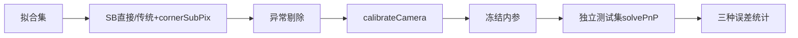

# 相机标定报告

## 流程



- 最终拟合图像：14张；测试图像：6张。
- 角点方法统计：SB=20。
- 拟合异常图：无。
- k3：固定为0。

## 三种误差

| 数据集 | mean_euclidean_reprojection_error | overall_reprojection_rmse | mean_per_image_rmse |
|---|---:|---:|---:|
| 拟合集 | 0.097393 | 0.114621 | 0.112771 |
| 独立测试集 | 0.104873 | 0.123149 | 0.121145 |

OpenCV `calibrateCamera()` 返回RMS：`0.114623174 px`。

## 内参

```text
[[7.349095486820e+03, 0.000000000000e+00, 2.071044502913e+03],
 [0.000000000000e+00, 7.350286760735e+03, 1.510118059985e+03],
 [0.000000000000e+00, 0.000000000000e+00, 1.000000000000e+00]]
dist_coeffs = [-0.0504399772762, 0.2295948921, -0.000588406537248, -0.000550410970184, 0]
```

## 图例

- `detected`：棋盘格检测角点。
- `reprojection`：绿色十字为实测角点，红色圆点为重投影点。
- `residual_vectors`：从重投影点指向实测角点，向量放大50倍。
- 测试集仅求外参并评价，从未参与相机内参拟合。
